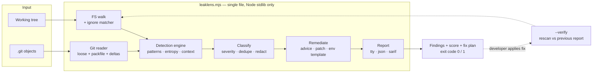
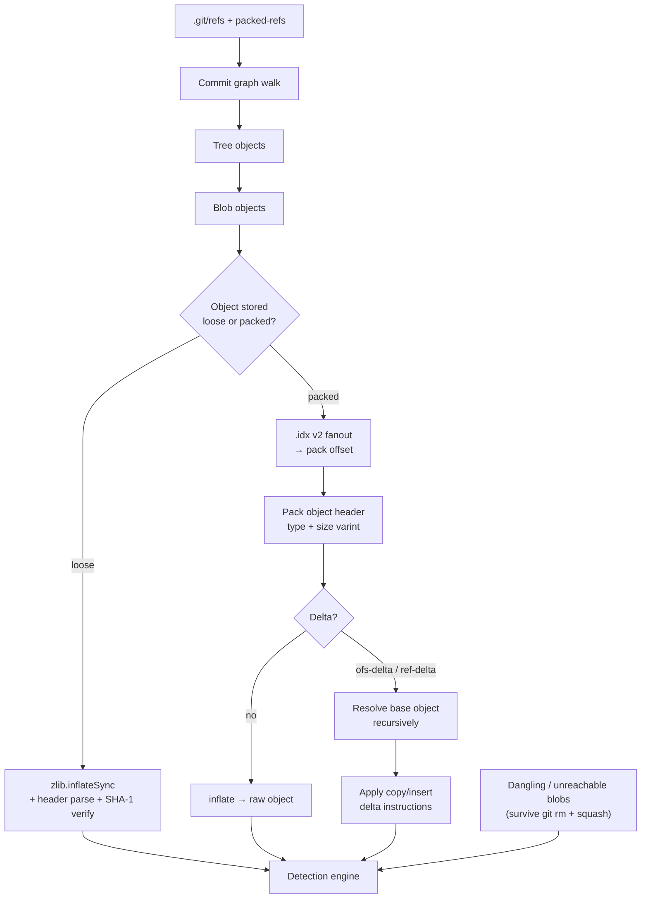
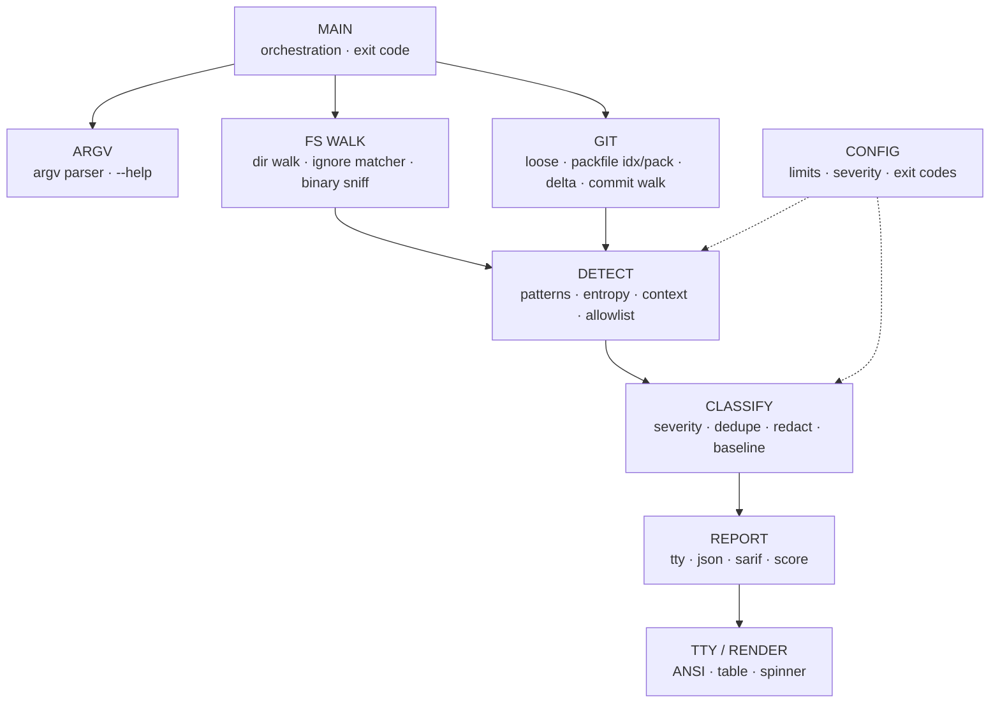
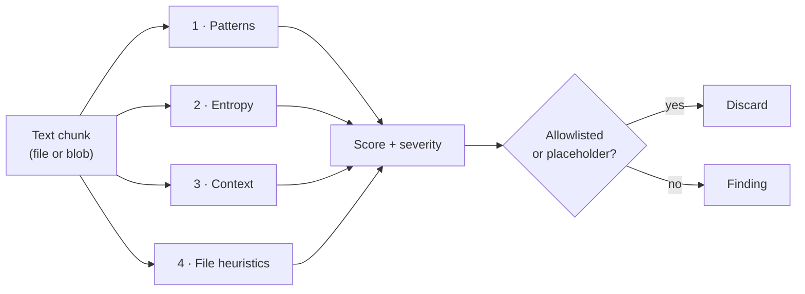
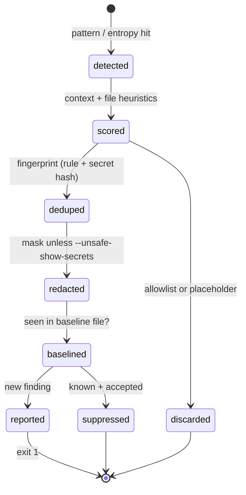
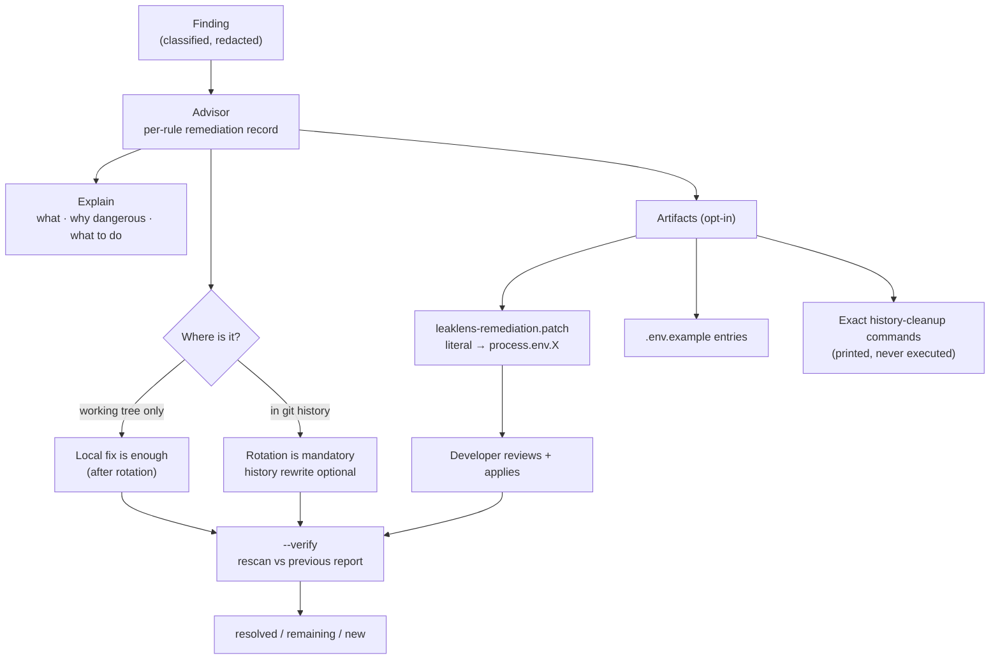
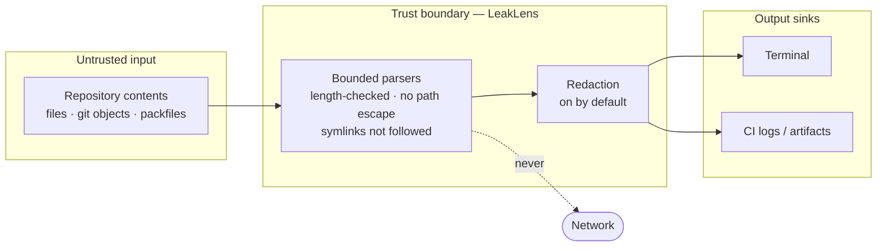
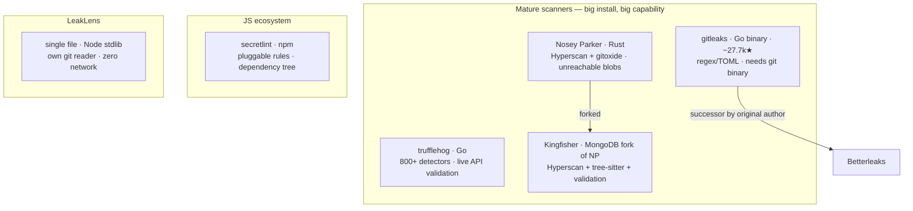

# Zero Dependency 2026 — Project Plan

> ⚠️ Planning doc only. **No project code may be committed before kickoff** (official rule).
> This file is documentation/planning, which is explicitly allowed beforehand.

## 0. At a glance



**Product arc: Detect → Understand → Remediate → Verify.** Not just detect.

| Decision | Value |
|---|---|
| Project | `LeakLens` — git-aware secret & credential scanner |
| Track | E — Security & Crypto Utilities |
| Runtime | Node.js, ESM, `node:` built-ins only |
| Shape | Single file `leaklens.mjs`, tests in `tests/` |
| Team | Solo |
| Package Killer target | `gitleaks` / `trufflehog` / `detect-secrets` |
| Differentiator | Own `.git` reader — no `git` subprocess, no `isomorphic-git` |
| Product arc | Detect → Understand → Remediate → Verify, all offline (§3b) |
| Bonus target | All +16 |
| Registration deadline | 2026-08-28 23:00 IST |

## 1. Official constraints (source: Unstop opportunity API, id 1733673)

| Item | Value |
|---|---|
| Event | Zero Dependency \| 72-Hour Hackathon — Hackathon Raptors |
| Registration | 2026-08-08 → 2026-08-28 23:00 IST |
| Format | Online, 72 hours, kickoff + submission instructions via Discord |
| Team | 1–4 members |
| Tracks | A Dev Tools/CLI · B Parsers/Formats · C Web/Network · D Data/Storage · E Security/Crypto · F Open |

### Scoring

| Criterion | Weight | What earns it here |
|---|---:|---|
| Functionality & Usefulness | **35%** | Finds real secrets in real repos, one command, sane exit codes |
| Zero-Dependency Craft | **30%** | Own git reader, own ignore matcher, own CLI — ~17 substitutions |
| Code Quality & Idiom | **25%** | Banner-sectioned single file, `node:test` suite, bounded parsers |
| Innovation | **10%** | Packfile + delta reconstruction, unreachable-blob discovery |

### Bonuses (+16 — all targeted)

| Bonus | Pts | Requirement | Our route |
|---|---:|---|---|
| 🧩 Single File | +5 | Whole project as one useful source file | `leaklens.mjs`, no bundler, no build step to inspect |
| 🔁 Reproducible Build | +5 | Build twice, byte-identical, publish both hashes | Deterministic `build.mjs` + `SHA256SUMS`, CI `cmp` |
| 📦 Package Killer | +3 | Reimplement a package people install | `gitleaks` + the npm shell around it |
| 📖 STDLIB Log | +3 | ≥10 documented substitutions | ~17 in STDLIB.md (§4) |

### Required submission artifacts

Public GitHub repo · working implementation · one-command build · empty dependency manifest ·
dependency proof · README.md · STDLIB.md · tests · 5-minute demo video. Tracked in §8.

### Rules that constrain us

| Rule | Consequence for us |
|---|---|
| All code written during the 72h; nothing committed before kickoff | Pre-work is docs/research only (§7) |
| Zero third-party **runtime** deps — Node built-ins only | Empty `package.json` manifest |
| No vendored third-party source to fake an empty manifest | Every parser is ours or stdlib |
| Dev-only deps must be disclosed in STDLIB.md | None planned; disclose if that changes |
| Track E: no hand-rolled crypto; document threat model | `node:crypto` only; §6 is mandatory |
| AI assistants allowed, not scored | Must be able to explain and defend every line |

## 2. Project

**`LeakLens` — a git-aware secret & credential scanner.** Track E (Security & Crypto Utilities).

```
node leaklens.mjs ./some-repo
node leaklens.mjs ./repo --history --format sarif --baseline .leaklens-baseline.json
```

Scans working tree **and git history** — including secrets deleted from HEAD but still reachable in
old commits, and blobs living only inside packfiles.

### Why this project, vs the alternatives considered

| Dimension | 🥇 Secret scanner | HTTP toolkit | Search engine |
|---|---|---|---|
| Demo legibility | ⭐⭐⭐⭐⭐ instant | ⭐⭐⭐ | ⭐⭐⭐ |
| Package Killer clarity | ⭐⭐⭐⭐⭐ gitleaks | ⭐⭐⭐ `node:http` does much of it | ⭐⭐⭐⭐ |
| Crypto risk (Track E) | none — `node:crypto` only | n/a | n/a |
| Single-file fit | ⭐⭐⭐⭐⭐ ~2k lines | ⭐⭐⭐⭐ | ⭐⭐⭐ index format bloats it |
| Solo 72h safety | ⭐⭐⭐⭐⭐ | ⭐⭐⭐ HTTP edge cases | ⭐⭐⭐⭐ |

### The differentiator (Innovation axis)

We read `.git` ourselves — no `git` subprocess, no `isomorphic-git`:



That last node is the demo moment: a secret deleted from HEAD, still reachable in history.

## 3. Architecture (single file, banner-sectioned)



Section order in the file matches this top-to-bottom. `tests/` stays outside the single file — the
bonus is about the *project source*, and separate tests read better than an inlined suite.

### Detection layers



| Layer | Signal | Examples | False-positive control |
|---|---|---|---|
| 1 · Patterns | Known credential shapes | `github_pat_`, `ghp_`, `AKIA…`, `-----BEGIN … PRIVATE KEY-----`, `xox[baprs]-`, `sk_live_`, JWT, `mongodb://user:pass@` | Checksum-validate where format allows (AWS key ID, Stripe) |
| 2 · Entropy | Shannon entropy over base64/hex windows | random 40-char blobs | Length-gated, charset-gated |
| 3 · Context | Assignment target name | `password`, `secret`, `token`, `api_key` raise score | `example`, `dummy`, `test`, `xxx`, repeated runs lower it |
| 4 · File heuristics | Path/filename | `.env`, `id_rsa`, `*.pem`, `*.key`, `credentials.json`, CI configs | Scoped, never sole evidence |

### Finding lifecycle



Every finding carries: severity, file, `line:col`, rule id, redacted match — and for history hits,
commit sha, author, date, and whether it still exists at HEAD.

## 3b. Remediation Advisor — "you found it, now what?"

Detection alone answers half the question a judge will ask. LeakLens answers the other half **without
ever touching a live credential**: no revocation calls, no rotation API, no history rewrite. It
explains, prepares, and verifies. The human acts.



### What we will and will not do

| Action | Verdict | Reason |
|---|---|---|
| Explain risk + ordered fix steps per secret type | ✅ core | Cheap, high judge value, zero risk |
| Emit `.env.example` keys for every detected literal | ✅ core | Deterministic, harmless |
| Emit a reviewable **patch** replacing literals with `process.env.X` | ✅ opt-in `--remediate` | Developer reviews `git diff` before applying |
| Print exact history-rewrite commands | ✅ printed only | We never rewrite someone's history |
| `--verify` rescan against a previous report | ✅ core | Closes the loop, great demo |
| Apply the patch ourselves / rewrite files in place | ❌ | Silent source rewriting breaks builds; a scanner is not a refactoring tool |
| Revoke / rotate / validate the credential | ❌ **never** | Needs network + the operator's own credentials — destroys the offline guarantee that is our whole USP (§6) |
| Rewrite git history automatically | ❌ **never** | Destructive, coordination-dependent, unrecoverable if wrong |

### Per-type advice (rule records carry this — it is data, not code)

| Secret type | Ordered remediation | Suggested replacement |
|---|---|---|
| GitHub PAT | revoke in GitHub settings → issue new token → replace literal → clean history if leaked | `process.env.GITHUB_TOKEN` |
| AWS access key | disable key in IAM → create replacement → move to env/secrets manager → clean history | `process.env.AWS_ACCESS_KEY_ID` |
| Private key / cert | revoke cert or key pair → generate new pair → update deploy config → purge old key | file path from env, never inline |
| DB connection string | rotate DB password → update connection config → restrict network access → clean history | `process.env.DATABASE_URL` |
| JWT signing secret | rotate secret → **invalidate outstanding tokens** → move to env | `process.env.JWT_SECRET` |
| Generic high-entropy | triage manually → allowlist if false positive → otherwise treat as above | — |

### ⚠️ Security bug in the naive patch design — and the fix

A unified diff that replaces a secret contains the secret **in the `-` line, in cleartext**. A
"remediation" file that writes the credential to a fresh untracked file — one a developer might
`git add .` straight into the repo — makes the exposure worse, not better.

| Control | Implementation |
|---|---|
| Patch written **outside the scan root** by default | `--remediate` writes to CWD only with `--out`, never silently into the scanned repo |
| Warn loudly at write time | `patch contains cleartext secrets — do not commit; delete after applying` |
| Restrictive mode | `fs.writeFileSync(path, data, { mode: 0o600 })` |
| Append to `.gitignore` | Only with explicit `--remediate-ignore`, and we print the line we added |
| Redacted variant by default | `--remediate` emits the human-readable plan; the applicable patch needs `--remediate-patch` (explicit second opt-in) |

### ⚠️ `--verify` must never overstate

The user-facing "Security Score: 100/100 ✓" after remediation is a **lie we must not tell** if the
blob is still in history, and is unknowable regardless — rotation happens at the provider, and we
make no network calls, so we cannot confirm it. Verify output separates three facts:

| Fact | Can we know it offline? | Wording |
|---|---|---|
| Literal gone from working tree | ✅ yes | `working tree: clean` |
| Blob gone from git history | ✅ yes — we enumerate the object database | `history: 1 object still reachable` |
| Credential actually rotated at the provider | ❌ **no** | `rotation: cannot be verified offline — confirm with your provider` |

That third row is a feature, not an apology: it is the honest version of what trufflehog does with a
network call, and it is exactly the trade-off our threat model chose.

### CLI surface

| Command | Does |
|---|---|
| `LeakLens ./repo` | scan working tree, print findings + advice |
| `LeakLens ./repo --history` | + git objects, incl. unreachable blobs |
| `LeakLens ./repo --remediate` | + write `leaklens-remediation.md` fix plan |
| `LeakLens ./repo --remediate-patch --out ../fix.patch` | + emit unified diff (contains secrets, mode 0600, warned) |
| `LeakLens ./repo --verify prev-report.json` | rescan, print resolved / remaining / new |
| `--format json\|sarif` · `--unsafe-show-secrets` | output control |

## 4. Bonus strategy

| Bonus | How |
|---|---|
| Single File +5 | One `leaklens.mjs`. Banner sections, no bundler, no build step to inspect. |
| Reproducible Build +5 | `build.mjs` copies source → `dist/leaklens.mjs` with a deterministic header (no timestamps, no hostname, LF-normalized), then emits `dist/SHA256SUMS`. Run twice in CI, `cmp` the outputs, publish both hashes in README. |
| Package Killer +3 | Headline: `gitleaks`/`trufflehog`. Supporting: `simple-git`, `pako`, `commander`, `chalk`, `glob`, `ignore`, `dotenv`. |
| STDLIB Log +3 | ≥15 substitutions, table below. |

### STDLIB.md substitution table (draft — need ≥10, have ~17)

| Normally | Instead |
|---|---|
| `gitleaks` / `trufflehog` / `detect-secrets` | this tool |
| `simple-git` / `isomorphic-git` / `nodegit` | own `.git` object + packfile reader |
| `pako` / `zlib-js` | `node:zlib` `inflateSync` |
| `commander` / `yargs` / `minimist` | own `process.argv` parser |
| `chalk` / `picocolors` / `kleur` | ANSI escapes + `node:tty` `isatty` |
| `ora` / `cli-progress` | `\r` + `process.stderr.write` |
| `cli-table3` / `table` | own column formatter |
| `glob` / `fast-glob` / `readdirp` | `node:fs` `opendirSync` recursive walk |
| `ignore` / `minimatch` | own gitignore glob matcher |
| `dotenv` | own `.env` line parser |
| `js-yaml` | minimal YAML scalar scanner (secret extraction only) |
| `p-limit` / `piscina` / `workerpool` | `node:worker_threads` + own queue |
| `shannon-entropy` / `entropy-string` | own entropy fn |
| `hasha` / `sha.js` / `js-sha1` | `node:crypto` `createHash` |
| `iconv-lite` / `isbinaryfile` | `node:buffer` NUL/ratio heuristic |
| `node-sarif-builder` | own SARIF 2.1.0 JSON emitter |
| `diff` / `jsdiff` | own unified-diff emitter for `--remediate-patch` |
| `jest` / `mocha` / `chai` | `node:test` + `node:assert` |
| `tmp` / `rimraf` | `fs.mkdtempSync` + `fs.rmSync({recursive:true})` |

Dev-only deps: **none planned.** If that changes, it goes in STDLIB.md.

## 5. 72-hour schedule

**Solo build, Node.js.** 72 wall-clock hours ≈ 48–52 working hours after sleep. The table below is
wall-clock; the gaps between blocks are sleep and food. Anything not in the table is out of scope.

```mermaid
gantt
    title 72-hour build (solo)
    dateFormat HH
    axisFormat %H
    section Core
    CLI + walk + test harness   :a1, 00, 4h
    Detection engine            :a2, after a1, 8h
    section Git internals
    Loose objects + commit walk :b1, after a2, 8h
    Packfile idx + deltas       :b2, after b1, 8h
    section Output
    Perf pass                   :c1, after b2, 6h
    Reporting json/sarif/score  :c2, after c1, 6h
    Remediation advisor + verify:c3, after c2, 6h
    section Harden
    Edge cases + full tests     :d1, after c3, 8h
    Reproducible build + proof  :d2, after d1, 6h
    section Ship
    README + STDLIB.md          :e1, after d2, 5h
    Demo video                  :e2, after e1, 5h
    Buffer + submit             :e3, after e2, 2h
```



| Hours | Work | Done means |
|---|---|---|
| 0–4 | Repo, `node:test` harness, CLI arg parser, dir walk, ignore matcher, output skeleton | `LeakLens ./dir` walks and prints file count |
| 4–12 | Detection engine: patterns, entropy, context scoring, redaction, dedupe, line/col | finds seeded secrets in a fixture tree, exit code 1 |
| 12–20 | Git loose objects: inflate, header parse, sha verify, commit graph walk, blob scan | finds a secret in a deleted-then-committed file |
| 20–28 | Packfiles: `.idx` v2, `.pack` headers, ofs/ref delta reconstruction | scans a `git gc`'d repo correctly |
| 28–34 | Perf pass on a large real repo (stream files, bound memory). `worker_threads` pool **only if** the single-threaded scan is embarrassingly slow | 10k+ files in reasonable time, memory bounded |
| 34–40 | Reporting: terminal, `--format json`, `--format sarif`, security score | GitHub code-scanning ingests our SARIF |
| 40–46 | **Remediation advisor** (§3b): per-rule advice records, `--remediate` plan, `.env.example`, `--remediate-patch` unified-diff emitter, `--verify` | detect → remediate → verify runs end to end on the fixture |
| 46–54 | Edge cases + full test suite: malformed objects, huge files, binaries, symlinks, submodules, CRLF, unicode, patch applies cleanly | tests green, no crash on adversarial input |
| 54–60 | Reproducible build script, run twice, hashes published; dependency proof script | two builds `cmp`-identical |
| 60–65 | README.md, STDLIB.md, threat model section, vulnerable demo repo generator | docs complete |
| 65–70 | 5-minute demo video (detect → remediate → verify arc), final polish | video uploaded |
| 70–72 | Buffer, submit | submitted |

### Scope cut lines (solo — drop in this order if behind)
1. `--remediate-patch` (unified-diff emitter) → keep the written plan + `.env.example` only.
   The advice text is 90% of the judge value at 10% of the cost.
2. `worker_threads` → single-threaded. Correctness beats throughput on a 35% functionality axis.
   Treat the thread pool as a stretch goal, not a plan item.
3. SARIF → JSON only.
4. Packfile **delta** support → loose objects + non-delta packed objects only. Mark the ceiling in a
   code comment and in README ("run `git unpack-objects` for full history coverage").

Never cut: the remediation **advice text** and `--verify`. Both are nearly free (advice is data on
the rule records; verify is a rescan plus a set difference) and they carry the whole
Detect→Remediate→Verify story. Cut 4 costs the innovation story, so it goes last — but a `git gc`'d
repo is the common case, so if hour 28 arrives with deltas unfinished, finish deltas and cut 1–3.

### Solo discipline rules
- Hard stop on any single bug at 90 minutes. Cut the feature, note the ceiling, move on.
- Commit every working increment. A green repo at hour 60 beats a broken repo at hour 71.
- Docs and video are **not** hour-64 work — draft README/STDLIB.md content as you build each
  section, so hours 58–70 are assembly, not writing from zero.
- Record the demo video by hour 68 even if the tool is imperfect. Missing artifact = missing points.

Never cut: tests, STDLIB.md, README, reproducible build. Those are graded or bonus-bearing directly.

## 6. Threat model (required by Track E, drafted now, refined during build)



| Aspect | Position |
|---|---|
| ✅ In scope | Detecting credentials committed to a repo the operator controls, including history |
| ❌ Out of scope | Validating credentials against live services — **zero network calls**, so the tool is offline-safe, CI-safe, and never leaks a secret to a third party |
| 🔐 Crypto | None invented. SHA-1 (git object identity) and SHA-256 (build hashes) from `node:crypto`. SHA-1 is addressing only, never a security boundary |
| 🙈 Output | Findings redacted by default; full values only behind `--unsafe-show-secrets`, because scanner output lands in CI logs |
| ⚠️ Untrusted input | Repos are attacker-controlled. All object parsing length-checked and bounded; no path escapes the scan root; symlinks not followed by default |
| 💣 Known limits | Detection is heuristic — false negatives are possible. A clean scan is not a proof of absence, and README says so |
| 🩹 Remediation | Advisory only. We never revoke, rotate, rewrite files, or rewrite history — those need network access, the operator's own credentials, and team coordination we cannot have (§3b) |
| 📄 Patch files | A unified diff necessarily contains the secret in cleartext. Written outside the scan root, mode `0600`, behind a second explicit flag, with a do-not-commit warning (§3b) |
| ✅ Verify honesty | `--verify` proves the literal left the tree and the blob left the object database. It **cannot** prove the credential was rotated — no network, so we say so instead of scoring 100/100 |

## 6b. Competitive landscape (researched 2026-08-23)



| Tool | Lang / install | History method | Network | Deps to run |
|---|---|---|---|---|
| **gitleaks** | Go binary download | shells out to `git log -p`, parses patches | none | git binary required |
| **Betterleaks** | Go binary, gitleaks-config compatible | same lineage | none | git binary |
| **trufflehog** | Go binary | go-git; also S3, Docker, Slack, Jira, GH/GL orgs | **yes — validates creds live** | none |
| **Nosey Parker** | Rust binary | gitoxide, enumerates blobs incl. **unreachable** | none | none |
| **Kingfisher** | Rust binary (MongoDB) | NP lineage + tree-sitter + checksum + validation | **yes** | none |
| **secretlint** | npm | files only, not git history | none | dozens of npm packages |
| **detect-secrets** | pip (Yelp) | baseline-oriented | none | pip tree |
| **LeakLens (ours)** | `node leaklens.mjs` | own `.git` reader: loose + pack + delta, incl. unreachable | **never** | Node only |

### Where we honestly lose

| Axis | Reality |
|---|---|
| Detector count | trufflehog 800+, gitleaks 150+. We ship ~25–40 good rules. |
| Raw speed | Hyperscan SIMD (NP/Kingfisher) beats JS `RegExp`. We are not winning a benchmark. |
| Live validation | trufflehog/Kingfisher confirm a secret is still active. We deliberately never will. |
| Non-git sources | S3, Docker images, Slack, Jira — out of scope. |
| FP tuning maturity | Years of rule tuning behind gitleaks. Ours is 72 hours old. |

> ⚠️ README must say this plainly. Claiming parity with trufflehog is the fastest way to lose
> credibility with a judge who has used it.

### Where we genuinely win

| Claim | Why it holds | Demoable? |
|---|---|---|
| **A security tool with no supply chain** | Every competitor is a binary you trust or an npm/pip tree you audit. Ours is one readable file, zero deps — the scanner cannot itself be a supply-chain vector. | ✅ `cat` the manifest |
| **No `git` binary required** | gitleaks/git-secrets shell out to `git`. We parse `.git` directly — works on a bare repo in a minimal container with no git installed. | ✅ run in `node:alpine`, no git |
| **Offline by construction** | trufflehog/Kingfisher send candidate secrets to third-party APIs to validate. Airgapped, regulated, or incident-response contexts forbid that. We make zero network calls — a property, not a setting. | ✅ run with network disabled |
| **Finds what `git log -p` cannot** | gitleaks walks reachable commits. Blobs from amended/dropped/rebased commits stay in `.git` and stay invisible to it. We enumerate the object database. | ✅ **headline demo** |
| **Auditable in one sitting** | ~2k lines, one file. A reviewer can verify the tool never exfiltrates what it finds. | ✅ scroll the file |
| **Closes the loop, offline** | gitleaks/trufflehog/Nosey Parker stop at detection — remediation is left to the operator or to a paid platform layer. We ship advice + a reviewable patch + `--verify` in the same binary-free file, with no network. | ✅ detect → remediate → verify demo |

> Honesty note: **Nosey Parker and Kingfisher also scan unreachable blobs.** Our unreachable-blob
> claim is a differentiator against *gitleaks*, not against the Rust field. Phrase it that way.

### Positioning line for README + video

> "LeakLens is not trying to out-detect trufflehog. It is the secret scanner you can run when you
> cannot install anything, cannot use the network, and cannot take the scanner itself on trust —
> one file, Node standard library, no `git` binary, no callbacks home."

> Honesty note 2: GitGuardian's `ggshield` and GitHub's own secret scanning do offer remediation
> guidance — but as a **cloud product**, with an account and network calls. The offline, no-account,
> single-file version of that loop is ours.

### Demo consequence (goes in the video, ~2 min)

1. Fixture repo: commit a secret, amend it away. HEAD is clean, blob is unreachable.
2. `git log -p | grep` → nothing. (Show the mechanism gitleaks relies on coming up empty.)
3. `node leaklens.mjs ./fixture --history` → finds it, prints the orphaned object id **plus the
   ordered remediation steps for that credential type**.
4. `node leaklens.mjs ./fixture --remediate` → writes the fix plan + `.env.example` keys.
5. Apply the fix, then `node leaklens.mjs ./fixture --verify report.json` →
   `working tree: clean · history: 1 object still reachable · rotation: cannot be verified offline`.
   Say that line out loud in the video — it is the most honest sentence in the whole demo.
6. `docker run --network none node:alpine node leaklens.mjs /repo` → same result, no git, no network.

## 7. Pre-kickoff prep (allowed — no code)

- [ ] Register on Unstop, join the Raptors Discord, confirm exact kickoff time
- [ ] Solo entry — register as a team of one
- [ ] Read specs: git pack format, `.idx` v2 layout, delta encoding, gitignore matching rules
- [ ] Collect real secret formats + their checksum schemes (AWS, Stripe, GitHub, Slack)
- [ ] Decide final name, pick license (MIT), draft README skeleton in a scratch doc
- [ ] Pre-write AI prompts per milestone
- [ ] Prepare a machine with a large repo cloned for perf testing
- [ ] Install gitleaks + trufflehog beforehand for the head-to-head demo (§6b) — they are comparison
      targets, never runtime deps, and never enter the repo

## 8. Submission checklist

- [ ] Public GitHub repo, no commits before kickoff
- [ ] `leaklens.mjs` — single file, runs on `node leaklens.mjs <path>`
- [ ] Empty dependency manifest (`package.json` with no `dependencies`/`devDependencies`)
- [ ] Dependency proof (`npm ls --all` output + manifest screenshot/script)
- [ ] One documented build command
- [ ] README.md — what/why/usage/architecture/track justification/threat model/build hashes
- [ ] STDLIB.md — ≥10 substitutions (we target ~17), dev-dep disclosure
- [ ] Tests — `node --test` (including: patch applies cleanly, `--verify` reports history honestly)
- [ ] Remediation advice record for every shipped rule — no rule ships without a fix path
- [ ] Reproducible build: two runs, byte-identical, both hashes published
- [ ] 5-minute demo video
