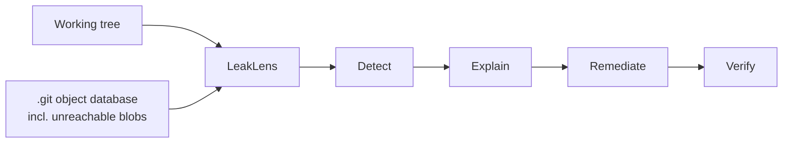
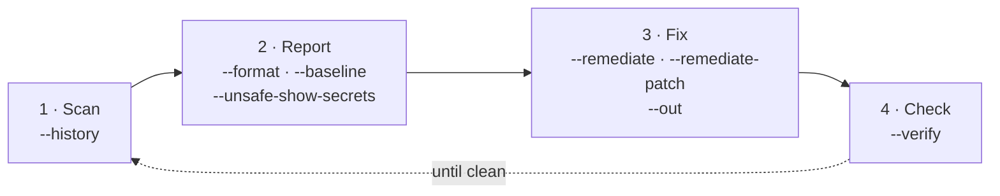
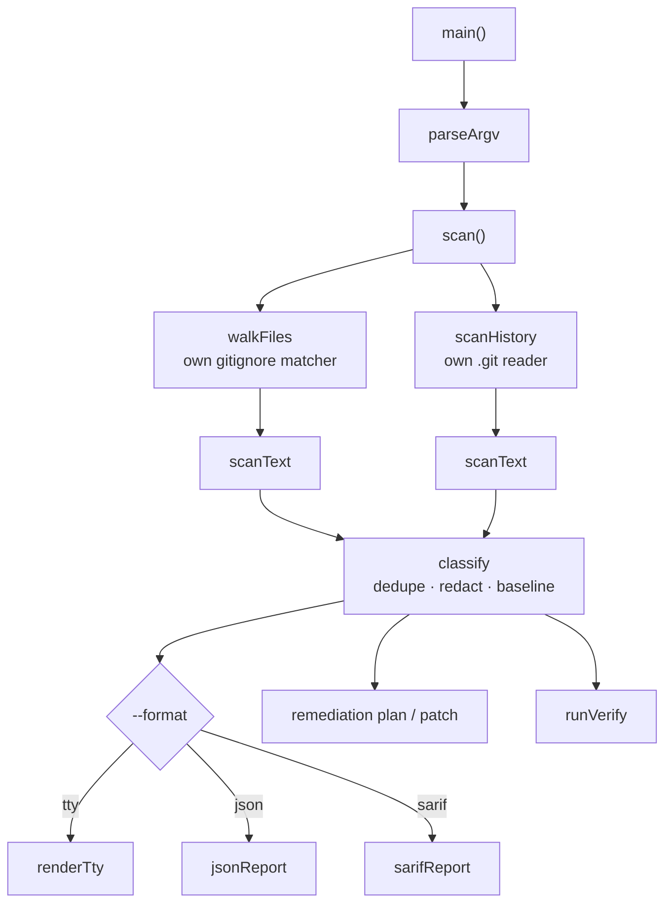
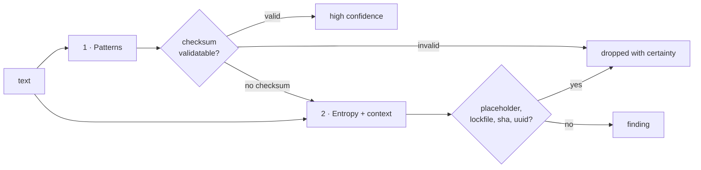

# LeakLens

**A git-aware secret scanner in one file of Node.js. No dependencies, no `git` binary, no network.**

Finds credentials in your working tree *and* in your git object database — including blobs that
`git log -p` structurally cannot show you, because no ref points at them any more.

```bash
node leaklens.mjs ./your-repo --history
```

That is the entire installation procedure.

## Why

Secret scanners are the tools you trust most and audit least. `gitleaks` is a Go binary you
download. `trufflehog` sends candidate credentials to third-party APIs to check whether they are
live. `secretlint` pulls a dependency tree into the project it is protecting.

LeakLens is one readable file that runs on any machine with Node, reads `.git` itself, and never
opens a socket. The tool that reads all of your secrets should be the one you can finish reading
yourself.

## What it does



| Stage | Meaning |
|---|---|
| Detect | Patterns with offline checksum validation, entropy, context, file heuristics |
| Explain | What the credential is, why the exposure matters, which account it belongs to |
| Remediate | Ordered fix steps, `.env.example` keys, an optional reviewable patch |
| Verify | Rescan and diff against the previous report — honestly, including what we cannot know |

## Install

There is no install. Requires **Node 20 or newer** (developed and tested on v22.18.0; the
implementation deliberately uses no Node-22-only API — see [STDLIB.md](STDLIB.md)).

```bash
git clone <repo> && cd leaklens
node leaklens.mjs --help
```

There is nothing to install because there is nothing to install *from* — but the conventional
commands exist and each is one command:

| Command | Does |
|---|---|
| `npm run build` | Produces `dist/leaklens.mjs` + `SHA256SUMS`. Run twice, compare — byte-identical |
| `npm test` | 95 unit tests + 29 end-to-end cases, `node:test` only |
| `npm run prove` | Static proof of zero dependencies over our own source |
| `npm ls --all` | Empty tree — the other half of the proof |

## Usage

Every flag belongs to one of four stages — the tool is this pipeline:



| Stage | Question it answers | Flags |
|---|---|---|
| Scan | Just files, or all of git history? | `--history` |
| Report | How should findings be shown, and which known ones hidden? | `--format`, `--unsafe-show-secrets`, `--baseline` |
| Fix | What do I do about them? | `--remediate`, `--remediate-patch`, `--out` |
| Check | Did my fix actually work? | `--verify` |

| Command | Does |
|---|---|
| `node leaklens.mjs ./repo` | Scan the working tree |
| `node leaklens.mjs ./repo --history` | Also scan git history, including unreachable objects |
| `node leaklens.mjs ./repo --remediate` | Write a remediation plan and `.env.example` keys |
| `node leaklens.mjs ./repo --remediate-patch --out ../fix.patch` | Emit a reviewable unified diff ⚠️ contains cleartext secrets |
| `node leaklens.mjs ./repo --verify prev.json` | Rescan, report resolved / remaining / new |
| `node leaklens.mjs ./repo --baseline .leaklens-baseline.json` | Suppress known-accepted findings |
| `node leaklens.mjs --build` | Build the distributable artifact + `SHA256SUMS` |
| `node leaklens.mjs --prove` | Prove zero dependencies, no subprocess, no network |
| `--format json\|sarif` | Machine-readable output |
| `--unsafe-show-secrets` | Print full values — off by default for a reason |
| `--include-vendor` | Also scan `node_modules/` and `vendor/` |

### Exit codes

| Code | Meaning |
|---|---|
| 0 | No findings |
| 1 | Findings present |
| 2 | Usage error |
| 3 | Scan error (unreadable repo, corrupt objects beyond tolerance) |

## Example output

```
  LeakLens v0.1.0  ·  /home/you/project
  181 files · 532 git objects · 2.8s

  server/.env
    ◆ medium  1:18  google-api-key        AIza…fU  working tree
      ↳ browser-embedded Google keys are often intentionally public — verify
        restrictions instead of assuming compromise
    ◆ medium  5:1   generic-high-entropy  GROQ…iS  working tree

  config/deploy.js
    ● critical  12:22  github-token-classic  ghp_…9x  history, 4640213b, UNREACHABLE — invisible to git log
      ↳ committed by A. Developer on 2026-08-14

  ─────────────────────────────────────────────────────────────────────────────
  Score 65/100  █████████████░░░░░░░
  3 finding(s) · 1 critical · 2 medium

  Next
    --remediate            write an ordered fix plan and .env.example keys
    --unsafe-show-secrets  reveal full values (redacted above)
    --format json          machine-readable, keeps every skipped-file path
```

Values are redacted by default. Skipped files are always reported, never silently dropped — a
scanner that quietly skips is lying about its coverage.

## What makes it different

| | LeakLens | gitleaks | trufflehog |
|---|---|---|---|
| Install | `node file.mjs` | binary download | binary download |
| Needs the `git` binary | no | **yes** (`git log -p`) | no |
| Sees unreachable blobs | **yes** | no | no |
| Network calls | **never** | none | yes, validates credentials |
| Remediation guidance | **yes** | no | no |
| Detector count | 16 rules + entropy | 150+ | 800+ |
| Runtime dependencies | **0** | n/a (binary) | n/a (binary) |

**Where the other tools win, plainly:** trufflehog knows whether a credential is still live; we
never will, by design. Nosey Parker and Kingfisher are far faster — Hyperscan SIMD beats JavaScript
`RegExp` — and they also enumerate unreachable blobs, so that claim is a differentiator against
*gitleaks*, not against the Rust field. gitleaks has years of rule tuning behind it; ours is days
old. LeakLens is the one you run when you cannot install anything, cannot reach the network, and
want to read the scanner before trusting it.

## How it works



`scanText` (`leaklens.mjs:1188`) is the only place secrets are found. Working-tree files and git
blobs both arrive there as a string; everything else is plumbing.

### Reading git without git

Five passes over the object database, and the order is the point:

| Pass | What it does | Code |
|---|---|---|
| 1 | Walk commits reachable from refs → blobs marked `reachable` | `leaklens.mjs:730` |
| 2 | Collect HEAD's blobs → lets a finding say "still at HEAD" vs "removed" | `leaklens.mjs:763` |
| 3 | Enumerate **every** object, find commits pass 1 never saw | `leaklens.mjs:637`, `leaklens.mjs:778` |
| 4 | Walk those → blobs get paths and attribution, marked unreachable | `leaklens.mjs:786` |
| 5 | Scan every blob, plus orphans nothing referenced | `leaklens.mjs:788` |

Pass 3 is what `git log -p` structurally cannot do, because `git log` only walks refs. Objects
from amended, dropped, or rebased commits stay in `.git` and stay invisible to it.

Reading a packed object means: `.idx` v2 fanout table → binary search of the sorted sha table
(`leaklens.mjs:410`) → 4-byte offset with an MSB escape into the 8-byte large-offset table
(`leaklens.mjs:393`) → object header varint → and for deltas, resolving the base and applying the
copy/insert instruction stream (`leaklens.mjs:428`), with a depth cap and cycle detection so a
hostile repository cannot hang the scan.

SHA-1 appears here as **object addressing, never a security boundary**: we recompute it to confirm
we read what git wrote, and refuse content that disagrees (`leaklens.mjs:612`).

### Detection



Two derivations run entirely offline, and are the reason LeakLens can be precise without a
network call:

| Derivation | What it buys |
|---|---|
| GitHub token: `base62(CRC32(entropy))` must equal the last 6 characters | A bad checksum is **provably not a token** — dropped, not reported |
| AWS key id → 12-digit account id, by base32 decode | Names the account to go disable the key in |

The entropy layer requires **two** signals — high entropy *and* a secret-ish word on the line or an
env-ish filename — then filters lockfiles, minified lines, data URIs, git shas, UUIDs and
`sha512-` integrity hashes. A value a rule rejected with certainty is never resurrected by the
entropy pass; otherwise checksum validation would buy nothing.

## Threat model

Track E requires this section, and it is the honest part of the pitch.

| Aspect | Position |
|---|---|
| In scope | Credentials committed to a repository the operator controls, working tree and history |
| Out of scope | Confirming a credential is live — **zero network calls**, so LeakLens is safe offline, in CI, and during incident response |
| Crypto | None invented. SHA-1 (git object identity), SHA-256 (fingerprints, build hashes), CRC32 (token checksums), all from `node:crypto` / `node:zlib`. Compose, never invent |
| Output | Findings redacted by default; `--unsafe-show-secrets` is opt-in because scanner output lands in CI logs |
| Untrusted input | Repositories are attacker-controlled. Parsers are length-bounded, a declared inflated size over 10 MB is refused **before** allocation so a decompression bomb is never expanded, delta chains are depth-capped and cycle-checked, tree entry names can never resolve to real paths, symlinks are not followed |
| Remediation | Advisory only. LeakLens never revokes, rotates, rewrites files, or rewrites history. History-cleanup commands are printed, never executed |
| Patch files | A unified diff necessarily contains the secret in cleartext. Written mode `0600`, behind a second explicit flag, and **refused if the destination is inside any git repository** — "outside the scan root" is not the same as "safe" |
| Verify honesty | `--verify` proves the literal left the tree and the blob left the object database. It **cannot** prove the credential was rotated, so it says so instead of scoring 100/100 |

### Honest limits

- **A clean scan is not proof of absence.** Detection is heuristic.
- `.gitignore` is honoured at every level, but credential-shaped files (`.env*`, `*.pem`, `*.key`,
  `id_rsa`, `credentials.*`) are scanned **even when gitignored** — being ignored by git is not the
  same as being safe. `--include-vendor` additionally scans `node_modules/` and `vendor/`.
- Content over 5 MB is skipped — a working-tree file or a git blob alike — and always reported in
  the output, never silently. The separate 10 MB object cap is not a scan limit but a decompression
  guard: a packed object whose header *declares* a larger inflated size is refused before a byte is
  allocated (`leaklens.mjs:543`), so a bomb is never expanded to discover how big it was.
- 16 rules plus entropy. gitleaks ships 150+; trufflehog 800+.

## Zero-dependency proof

```bash
node leaklens.mjs --prove   # static proof over its own source
npm ls --all                # empty tree
cat package.json            # no dependencies, no devDependencies
```

`--prove` reads its own source and checks: every `import` is `node:`-prefixed, and there is no
subprocess module, no CommonJS loader, no dynamic module loading, no socket module, and no network
client API anywhere in the file. It never spawns a process to do this, because LeakLens cannot spawn
a process at all — which is the thing being proven.

```
  Dependency proof  leaklens.mjs

    ✔ manifest dependencies                  0 found
    ✔ manifest devDependencies               0 found
    ✔ every import is node: (5 total)        none
    ✔ no subprocess module                   clean
    ✔ no CommonJS loader                     clean
    ✔ no dynamic module load                 clean
    ✔ no socket modules                      clean
    ✔ no network client API                  clean

  All checks passed.
```

The same claims are enforced as tests, so they fail the build rather than merely being asserted in
this README — see the four `proof:` cases in `tests/leaklens.test.mjs`.

CI runs all of the above on every push, on Node 20 and 22, so the proof is a public log rather than
a claim: [`.github/workflows/ci.yml`](.github/workflows/ci.yml).

## Reproducible build

One command, no bundler, no build step to inspect:

```bash
node leaklens.mjs --build && cp dist/SHA256SUMS first-run.txt
node leaklens.mjs --build && diff first-run.txt dist/SHA256SUMS && echo "byte-identical"
```

The build LF-normalises, strips trailing whitespace and any BOM, and prepends a fixed banner. It
embeds **no timestamp, no hostname, no absolute path, and no environment data**, so two builds of
the same source are byte-identical on any machine.

```
dist/leaklens.mjs   86,877 bytes
SHA-256             662f85fa383901693a046ecbe5d7843f9b4aa87d5477ffe93d82e9de516d8d4d
```

Both runs on this machine produced that hash; `cmp` reports the artifacts and `SHA256SUMS` identical.
CI repeats the two-build comparison on every push, so reproducibility is verified on a clean machine
as well as this one.

## Tests

```bash
node --test
```

`tests/leaklens.test.mjs` covers the internals by importing them. `tests/e2e.test.mjs` runs the
real binary as a subprocess against purpose-built repositories from `tests/fixtures.mjs` — 29 cases
covering every detection rule, all three output formats, every exit code, the verify loop, the
remediation guard, and the reproducible build.

**95 tests, all passing.** They cover the argument parser and ignore matcher, every detection rule,
a false-positive corpus that must produce zero findings, delta application, the four zero-dependency
proofs, and a self-scan asserting this repository has no critical findings. Each refusal the threat
model names above is asserted by a test, not assumed: an untested guard is a guard that has never
actually run.

Many use real `git` as a **test oracle** — fixtures F1–F6 build repositories with secrets in the
working tree, deleted from HEAD, amended away, `git gc`-packed, delta-compressed, and truncated —
then assert LeakLens agrees. A further set feeds deliberately hostile input — corrupt zlib streams,
objects whose SHA-1 disagrees with their filename, truncated and unsupported pack indexes, garbage
in the object directory, UTF-16, lone surrogates, 600 KB single lines — and asserts the scan records
a note rather than crashing or silently skipping. `git` is not a runtime dependency and is not
imported; those tests skip cleanly when it is absent.

The headline test builds a repository, commits a secret, amends it away, asserts
`git log --all -p` cannot see it, and asserts LeakLens can.

## Track

Zero Dependency 2026, **Track E — Security & Crypto Utilities**. No cryptographic algorithm is
implemented here; `node:crypto` primitives are composed and the threat model is documented above,
as the track requires.

## Bonus claims

| Bonus | Claim |
|---|---|
| Single File | `leaklens.mjs` — 1,970 lines, the whole implementation including its own build command. No bundler, no build step to inspect |
| Reproducible Build | Two builds, byte-identical, hash published above |
| Package Killer | `chalk` (319.8M/wk), `ignore` (~30M/wk), `glob` (~70M/wk), `minimist` (80.5M/wk), and `gitleaks` — see [STDLIB.md](STDLIB.md) |
| STDLIB Log | 20 substitutions documented in [STDLIB.md](STDLIB.md) |

## License

MIT — see [LICENSE](LICENSE).

## Acknowledgements

Format specifications read, not code copied: git's `gitformat-pack` documentation. Prior art that
set the bar: gitleaks, trufflehog, Nosey Parker, Kingfisher.
