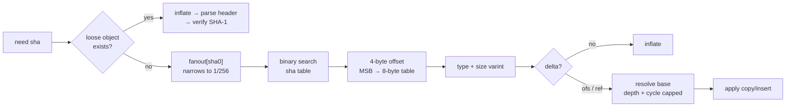

# STDLIB.md — what we would have installed, and what we used instead

LeakLens has **zero third-party runtime dependencies** and **zero development
dependencies**. This document lists every package a normal implementation of this tool would pull
in, and the Node standard-library functionality that replaced it.

## Summary

| | Count |
|---|---:|
| Runtime dependencies | **0** |
| Development dependencies | **0** |
| Documented substitutions | **20** |
| `node:` modules used | 5 — `fs`, `path`, `zlib`, `crypto`, `url` |
| Headline packages replaced | `gitleaks` · `chalk` · `ignore` |

Verify the first two yourself:

```bash
node leaklens.mjs --prove   # static proof, no subprocess
npm ls --all                # empty tree
```

## Substitutions

| # | Normally | Instead | Where |
|---:|---|---|---|
| 1 | `gitleaks` / `trufflehog` / `detect-secrets` — secret scanning | the whole tool | `leaklens.mjs` |
| 2 | `simple-git` / `isomorphic-git` / `nodegit` — git access | own `.git` reader: loose objects, `.idx` v2 fanout + binary search, pack object headers, ofs/ref delta resolution | `leaklens.mjs:277-819` |
| 3 | `pako` / `zlib-js` — decompression | `node:zlib` `inflateSync` | `leaklens.mjs:548`, `leaklens.mjs:594` |
| 4 | `commander` / `yargs` / `minimist` — argument parsing | own `process.argv` parser with value flags, `--help`, and four distinct exit codes | `leaklens.mjs:50` |
| 5 | `chalk` / `picocolors` / `kleur` — terminal colour | ANSI escapes + `isTTY`, honouring `NO_COLOR` and `FORCE_COLOR` | `leaklens.mjs:113-121` |
| 6 | `ora` / `cli-progress` — progress display | `\r` + `\x1b[K` writes to `process.stderr`, throttled, TTY-only, self-erasing | `leaklens.mjs:1387` |
| 7 | `cli-table3` / `table` — column layout | own width-measuring formatter that ignores ANSI when measuring | `leaklens.mjs:1349` |
| 8 | `glob` / `fast-glob` / `readdirp` — file discovery | own `node:fs` iterative walk, symlinks never followed | `leaklens.mjs:218` |
| 9 | `ignore` / `minimatch` — gitignore semantics | own glob matcher: `*`, `**`, `?`, `[...]`, `!` negation, directory-only and anchored patterns, last-match-wins | `leaklens.mjs:125`, `leaklens.mjs:173` |
| 10 | `dotenv` — `.env` parsing | `.env` files are read as untrusted text and pattern-scanned, never evaluated | `leaklens.mjs:1188` |
| 11 | `shannon-entropy` / `entropy-string` | own Shannon entropy over charset-gated windows | `leaklens.mjs:825` |
| 12 | `hasha` / `sha.js` / `js-sha1` — hashing | `node:crypto` `createHash` — SHA-1 for git object identity, SHA-256 for fingerprints and build hashes | `leaklens.mjs:612`, `leaklens.mjs:1295` |
| 13 | `crc-32` — checksums | `node:zlib` `crc32`, with a table-driven fallback for older Node | `leaklens.mjs:838` |
| 14 | `iconv-lite` / `isbinaryfile` — binary detection | NUL-byte and control-character-ratio heuristic over the first 8 KB | `leaklens.mjs:265` |
| 15 | `node-sarif-builder` — SARIF output | own SARIF 2.1.0 emitter that GitHub code scanning accepts | `leaklens.mjs:1522` |
| 16 | `diff` / `jsdiff` — patch generation | own unified-diff emitter for `--remediate-patch` | `leaklens.mjs:1629` |
| 17 | `jsonwebtoken` / `jwt-decode` — JWT inspection | `Buffer.from(segment, "base64url")` + `JSON.parse`, header and payload only, never verified or trusted | `leaklens.mjs:899` |
| 18 | `jest` / `mocha` / `chai` — testing | `node:test` + `node:assert` | `tests/leaklens.test.mjs` |
| 19 | `tmp` / `rimraf` — temp dirs in tests | `fs.mkdtempSync` + `fs.rmSync({ recursive: true })` | `tests/leaklens.test.mjs:220-221` |
| 20 | `esbuild` / `rollup` / `tsup` — build step | `node leaklens.mjs --build`: LF-normalise, fixed banner, SHA-256, no bundler | `leaklens.mjs:1679` |

## Why hand-roll what Node 22 already ships?

Four rows above — 4, 5, 8, 10 — replace packages that recent Node versions also replace:
`util.parseArgs`, `util.styleText`, `fs.globSync`, `process.loadEnvFile`. Using the built-ins would
have been less code. We wrote our own anyway, for two reasons that are checked by tests rather than
asserted in prose:

| Reason | Evidence |
|---|---|
| **Portability.** Those built-ins are gated on Node 20.6–22.17. LeakLens uses **zero** v22-only APIs, so it runs on Node 20 — still the version in most LTS containers and CI images | `tests/leaklens.test.mjs` — *"proof: implementation avoids Node-22-only APIs"* |
| **Semantics.** `fs.globSync` cannot express gitignore's negation and last-match-wins rules; `parseArgs` handles only `string` and `boolean`, so it cannot express `--out <path>` plus per-error exit codes; `loadEnvFile` *loads* what we must treat as untrusted input | `leaklens.mjs:173` (matcher), `leaklens.mjs:50` (parser) |

The same reasoning drives row 13: call `zlib.crc32` when it exists, ship a table when it does not,
and GitHub-token validation works either way.

## Package Killer: `chalk` (319.8M downloads/week)

The colour layer at `leaklens.mjs:113-121` replaces chalk outright, and matches its actual
behavioural contract rather than just emitting escape codes:

| Behaviour | chalk | LeakLens |
|---|---|---|
| Auto-disable when piped | yes | yes — `process.stdout.isTTY` |
| `NO_COLOR` respected | yes | yes, and it wins over `FORCE_COLOR` |
| `FORCE_COLOR=1` forces on | yes | yes |
| `FORCE_COLOR=0` forces off | yes | yes |
| Install size | a dependency tree | 14 lines |

Supporting kills: `ignore` (~30M/wk) at `leaklens.mjs:173`, `glob` (~70M/wk) at
`leaklens.mjs:218`, `minimist` (80.5M/wk) at `leaklens.mjs:50`.

## Package Killer: `gitleaks` — the substantive one

| | gitleaks | LeakLens |
|---|---|---|
| Distribution | Go binary download | one `.mjs` file |
| Reads history via | `git log -p` subprocess — **requires the git binary** | own object-database reader |
| Sees unreachable blobs | no — `git log` walks refs only | **yes** |
| Remediation guidance | no | yes, per rule |
| Runtime dependencies | n/a (binary) | **0** |

The substantive difference is not the regex list — it is that gitleaks delegates git to git.
LeakLens implements the parts of git's object model it needs: zlib framing, object headers, the pack
index fanout and binary search, and both delta encodings. That is roughly **542 lines**
(`leaklens.mjs:277-819`), and it is why LeakLens finds objects `git log -p` cannot show it.

## Notable substitutions, in detail

### Reading packfiles instead of shelling out to `git`



| Step | Code |
|---|---|
| `.idx` v2 magic, version, fanout, table offsets | `leaklens.mjs:366` |
| Fanout-narrowed binary search | `leaklens.mjs:410` |
| 4-byte offset with MSB escape to the 8-byte table | `leaklens.mjs:393` |
| Object header varint (type + inflated size) | `leaklens.mjs:521` |
| `OFS_DELTA` negative offset, including the `(ofs + 1) << 7` rule | `leaklens.mjs:555` |
| `REF_DELTA` by base sha, across packs | `leaklens.mjs:572` |
| Delta copy/insert stream, size-0-means-65536 | `leaklens.mjs:428` |
| Depth cap and cycle detection | `leaklens.mjs:525-499`, `leaklens.mjs:576` |

### Offline checksum validation instead of a validation API

Both are pure computation, which is why LeakLens can be precise without a network call:

| Derivation | What it buys | Code |
|---|---|---|
| GitHub token: base62(CRC32(entropy)) == last 6 chars | A bad checksum is **provably not a token**, so it is dropped rather than reported | `leaklens.mjs:876` |
| AWS key id → 12-digit account id via base32 decode | Names the account to go disable the key in | `leaklens.mjs:886` |

### A gitignore matcher instead of `ignore`

| Supported | Deliberately not supported |
|---|---|
| `*`, `**`, `?`, `[a-z]`, `[!abc]` | `.git/info/exclude`, global gitignore |
| `!` negation with last-match-wins | `core.excludesFile` |
| Directory-only (`build/`) and anchored (`/root.txt`) patterns | index-aware rules (a tracked file stays tracked) |
| Nested `.gitignore` at every level, deeper rules overriding shallower ones | |

Matching is tri-state — ignored, explicitly re-included, or no opinion — which is what lets a nested
`!negation` override a parent rule only where it actually says something.

One deliberate departure from git semantics: credential-shaped files (`.env*`, `*.pem`, `*.key`,
`id_rsa`, `credentials.*`) are scanned even when gitignored. A `.env` is the likeliest place to find
a real key, and being ignored by git does not make it safe.

## Development dependencies

**None.** The build command, the test suite, and the dependency proof are all plain Node.

`git` is used in the test suite as an **oracle** — fixtures are created with it and our reader's
output is asserted against what git produced. It is not required to run LeakLens, is not imported,
and is not part of the distributed artifact. Tests that need it skip cleanly when it is absent
(`tests/leaklens.test.mjs:204-205`).

## What we did *not* reimplement, and why

| Not reimplemented | Reason |
|---|---|
| Cryptographic hash functions | Track E forbids hand-rolled crypto. `node:crypto` composes trusted primitives — compose, never invent |
| The DEFLATE algorithm | `node:zlib` is the standard library. Reimplementing it would be showmanship, not engineering |
| A regex engine | `RegExp` is part of the language, not a package |
| Credential validation against provider APIs | Deliberate: zero network calls is a security property of this tool, not a missing feature |
