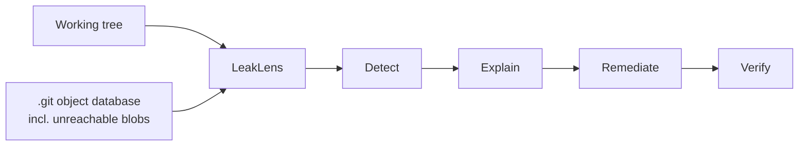
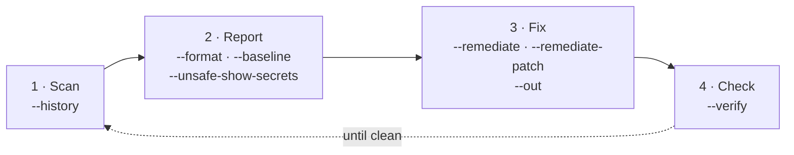

# README skeleton (draft — becomes README.md at kickoff)

> 📝 Structure and all non-result prose, written before kickoff. `<!-- FILL -->` markers are the
> only things that need the finished tool. Copy this into `README.md` during hours 60–65 and fill
> them in.

---

# LeakLens

**A git-aware secret scanner in one file of Node.js. No dependencies, no `git` binary, no network.**

<!-- FILL: one-line result from the demo repo, e.g. "Finds 7 credentials in 1,284 files and 642
commits in 3.1s" -->

```bash
node leaklens.mjs ./your-repo --history
```

That is the entire installation procedure.

## Why

Secret scanners are the tools you trust most and audit least. `gitleaks` is a Go binary you
download. `trufflehog` sends candidate credentials to third-party APIs to check whether they are
live. `secretlint` pulls a dependency tree into the project it is protecting.

LeakLens is one readable file that runs on any machine with Node, reads `.git` itself, and never
opens a socket. The tool that reads all of your secrets should be the one you can finish reading
yourself.

## What it does



| Stage | Meaning |
|---|---|
| Detect | Patterns with offline checksum validation, entropy, context, file heuristics |
| Explain | What the credential is, why the exposure matters, what happens if ignored |
| Remediate | Ordered fix steps, `.env.example` keys, an optional reviewable patch |
| Verify | Rescan and diff against the previous report — honestly, including what we cannot know |

## Install

There is no install. <!-- FILL: minimum Node version, confirmed at build time -->

```bash
git clone <repo> && cd LeakLens
node leaklens.mjs --help
```

## Usage

Every flag belongs to one of four stages — the tool is this pipeline:



| Stage | Question it answers | Flags |
|---|---|---|
| Scan | What am I looking at — just files, or all of git history? | `--history` |
| Report | How do I want findings shown, and which known ones to hide? | `--format`, `--unsafe-show-secrets`, `--baseline` |
| Fix | What do I do about them? | `--remediate`, `--remediate-patch`, `--out` |
| Check | Did my fix actually work? | `--verify` |

| Command | Does |
|---|---|
| `node leaklens.mjs ./repo` | Scan the working tree |
| `node leaklens.mjs ./repo --history` | Also scan git history, including unreachable objects |
| `node leaklens.mjs ./repo --remediate` | Write a remediation plan and `.env.example` keys |
| `node leaklens.mjs ./repo --remediate-patch --out ../fix.patch` | Emit a reviewable unified diff ⚠️ contains cleartext secrets |
| `node leaklens.mjs ./repo --verify prev.json` | Rescan, report resolved / remaining / new |
| `--format json\|sarif` | Machine-readable output |
| `--unsafe-show-secrets` | Print full values — off by default for a reason |

<!-- FILL: full flag table generated from --help output -->

### Exit codes

| Code | Meaning |
|---|---|
| 0 | No findings at or above the failure threshold |
| 1 | Findings present |
| 2 | Usage error |
| 3 | Scan error (unreadable repo, corrupt objects beyond tolerance) |

<!-- FILL: confirm against the implementation -->

## Example output

<!-- FILL: real terminal output from the demo fixture, including a remediation block -->

<!-- FILL: field-test line. Pre-kickoff validation (2026-08-27): 8 real local repos scanned,
~0.1–4s each (largest 843 files); found 2 live keys in one repo's server/.env (Google API key
by pattern rule, Groq key by the entropy layer); 1 false positive in a Next.js .next/ build
chunk ("unauthorized" matched the auth context regex + nested .gitignore not read — both fixed
by <!-- FILL: cite fix -->). Rerun and refresh numbers on the final build. -->

## What makes it different

| | LeakLens | gitleaks | trufflehog |
|---|---|---|---|
| Install | `node file.mjs` | binary download | binary download |
| Needs the `git` binary | no | **yes** (`git log -p`) | no |
| Sees unreachable blobs | **yes** | no | no |
| Network calls | **never** | none | yes, validates credentials |
| Remediation guidance | **yes** | no | no |
| Detector count | ~<!-- FILL --> | 150+ | 800+ |
| Runtime dependencies | **0** | n/a (binary) | n/a (binary) |

**Where the other tools win, plainly:** trufflehog knows whether a credential is still live; we
never will, by design. Nosey Parker and Kingfisher are far faster and also enumerate unreachable
blobs. gitleaks has years of rule tuning behind it. LeakLens is the one you run when you cannot
install anything, cannot reach the network, and want to read the scanner before trusting it.

## How it works

<!-- FILL: architecture diagram, mirroring PLAN.md §3 -->

### Reading git without git

<!-- FILL: short walkthrough with file:line citations — loose objects, .idx v2 binary search,
ofs/ref delta resolution, unreachable-object discovery -->

### Detection

<!-- FILL: layers, with the checksum-validation story: GitHub CRC32, AWS account-id derivation -->

## Threat model

| Aspect | Position |
|---|---|
| In scope | Credentials committed to a repository the operator controls, working tree and history |
| Out of scope | Confirming a credential is live — **zero network calls**, so LeakLens is safe offline, in CI, and during incident response |
| Crypto | None invented. SHA-1 (git object identity) and SHA-256 (build hashes) via `node:crypto`. SHA-1 is addressing, never a security boundary |
| Output | Findings redacted by default; `--unsafe-show-secrets` is opt-in because scanner output lands in CI logs |
| Untrusted input | Repositories are attacker-controlled. Parsers are length-bounded, paths cannot escape the scan root, symlinks are not followed by default |
| Remediation | Advisory only. LeakLens never revokes, rotates, rewrites files, or rewrites history |
| Patch files | A unified diff necessarily contains the secret in cleartext. Written outside the scan root, mode 0600, behind an explicit flag, with a do-not-commit warning |
| Limits | Detection is heuristic. **A clean scan is not proof of absence.** |

## Zero-dependency proof

```bash
cat package.json          # no dependencies, no devDependencies
npm ls --all              # empty tree
grep -c "from \"node:" leaklens.mjs   # every import is a built-in
```

<!-- FILL: paste actual output -->

## Reproducible build

```bash
node build.mjs && sha256sum dist/leaklens.mjs
node build.mjs && sha256sum dist/leaklens.mjs   # identical
```

<!-- FILL: both hashes, and the CI job link proving it -->

## Tests

```bash
node --test
```

<!-- FILL: test count, what they cover, including the oracle tests against git cat-file -->

## Track

Zero Dependency 2026, **Track E — Security & Crypto Utilities**. No cryptographic algorithm is
implemented here; `node:crypto` primitives are composed and the threat model is documented above,
as the track requires.

## Bonus claims

| Bonus | Claim |
|---|---|
| Single File | `leaklens.mjs` — <!-- FILL: line count -->, the whole implementation |
| Reproducible Build | Two builds, byte-identical, hashes above |
| Package Killer | `gitleaks` / `trufflehog` / `detect-secrets`, plus `simple-git`, `pako`, `commander`, `chalk`, `glob`, `ignore`, `dotenv` — see [STDLIB.md](STDLIB.md) |
| STDLIB Log | <!-- FILL: count --> substitutions documented in [STDLIB.md](STDLIB.md) |

## License

MIT. <!-- FILL: confirm LICENSE file present -->

## Acknowledgements

Format specifications read (not code copied): git's `gitformat-pack` documentation. Prior art that
set the bar: gitleaks, trufflehog, Nosey Parker, Kingfisher.
