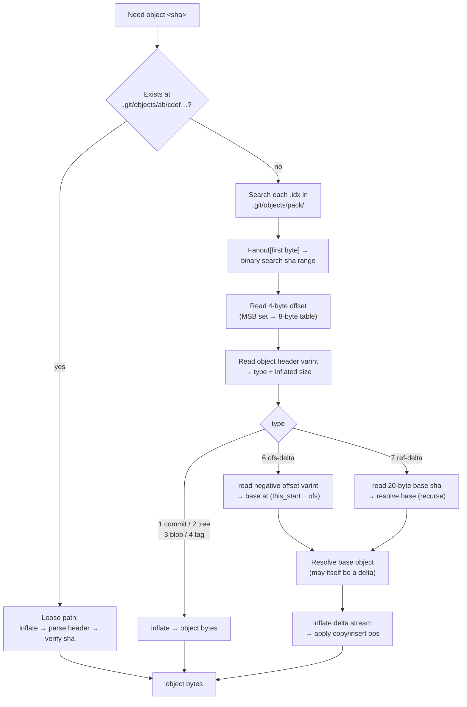
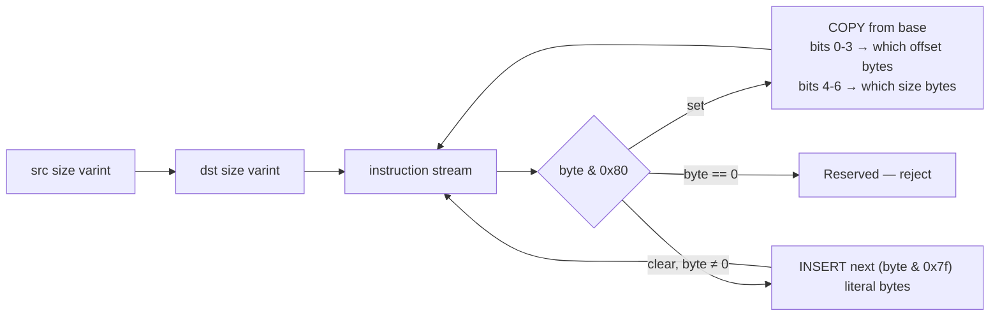
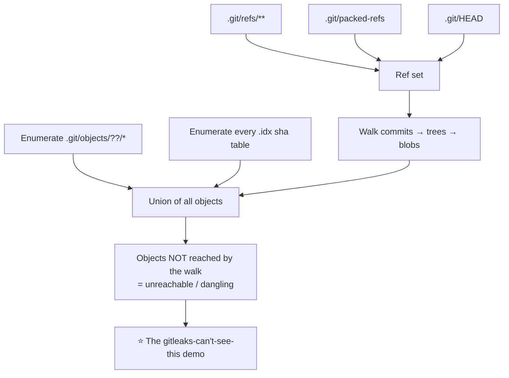

# Git object storage — implementation notes

> 📚 Research notes for hours 12–28 of the build. **Specification notes and pseudocode only — no
> project code.** Written before kickoff, which the rules explicitly permit.

## Why this document exists

Hours 20–28 (packfile + delta reconstruction) is the highest-risk block in [PLAN.md](../../PLAN.md).
Every byte layout below is a thing you would otherwise be reading a spec for *during* the clock.

## Object resolution overview



## Loose objects

| Element | Detail |
|---|---|
| Path | `.git/objects/<sha[0:2]>/<sha[2:40]>` |
| Encoding | zlib deflate of the whole thing (`node:zlib` `inflateSync`) |
| Inflated layout | `"<type> <size>\0<content>"` — type ∈ `blob`, `tree`, `commit`, `tag` |
| Identity | SHA-1 over the **inflated bytes including the header**, not over the content alone |
| Verification | Recompute SHA-1, compare with the path-derived sha. Mismatch = corrupt object, report and skip |

> ⚠️ SHA-1 here is **addressing, not security** (§6 of PLAN.md). Say that in the README before a
> judge asks why a security tool uses SHA-1.

## Packfile index — `.idx` version 2

Byte layout, in order:

| Offset | Size | Content |
|---|---|---|
| 0 | 4 | Magic `\377tOc` (`0xFF 0x74 0x4F 0x63`) |
| 4 | 4 | Version — must be `2` (v1 has no magic; detect by absence and treat as unsupported) |
| 8 | 1024 | **Fanout table**: 256 × uint32 BE. `fanout[b]` = count of objects whose first sha byte ≤ `b`. So `N = fanout[255]` |
| 1032 | 20 × N | Object SHA-1s, **sorted ascending** — binary search here |
| 1032 + 20N | 4 × N | CRC32 of each packed object's compressed data |
| 1032 + 24N | 4 × N | 4-byte offsets into the `.pack`. **If MSB is set**, the low 31 bits are an index into the next table |
| 1032 + 28N | 8 × K | Large offsets (packs > 2 GiB), uint64 BE |
| … | 20 | SHA-1 of the `.pack` file |
| … | 20 | SHA-1 of the `.idx` file up to this point |

**Lookup:** `lo = b === 0 ? 0 : fanout[b-1]`, `hi = fanout[b]` where `b = sha[0]`, then binary search
the sha table between `lo` and `hi`. That is why the fanout exists — it skips 255/256 of the range.

## Packfile — `.pack`

| Offset | Size | Content |
|---|---|---|
| 0 | 4 | `PACK` |
| 4 | 4 | Version — `2` or `3` |
| 8 | 4 | Object count |
| 12 | … | Objects, each: variable header, then a zlib stream |
| end | 20 | SHA-1 checksum of everything preceding |

### Object header varint (type + size)

First byte:

| Bit | Meaning |
|---|---|
| 7 (MSB) | Continuation — another byte follows |
| 6–4 | **Type** |
| 3–0 | Size bits 0–3 |

Each continuation byte: bit 7 = continuation, bits 6–0 = next 7 size bits. Assemble
**little-endian**: `size |= (byte & 0x7f) << (4 + 7 * i)` for the i-th continuation byte.

| Type | Meaning |
|---|---|
| 1 | commit |
| 2 | tree |
| 3 | blob |
| 4 | tag |
| 5 | reserved |
| 6 | `OFS_DELTA` — base identified by a negative offset |
| 7 | `REF_DELTA` — base identified by a 20-byte sha |

> The size in this header is the **inflated** size of the object (or of the delta instructions for
> delta types), not the compressed length. There is no stored compressed length — you inflate until
> the zlib stream ends, which means the decompressor must report how many input bytes it consumed.
> `zlib.inflateSync` does not; plan on `zlib.createInflate()` in a stream, or the sync-with-`info`
> variant, and record `bytesWritten`/`bytesRead`. **Find this out at hour 20, not hour 27.**

### `OFS_DELTA` negative-offset encoding

Not the same varint as the size field. Read as:

```
c    = next_byte
ofs  = c & 0x7f
while c has bit 7 set:
    c   = next_byte
    ofs = ((ofs + 1) << 7) | (c & 0x7f)
base_offset = offset_of_this_object_header - ofs
```

The `+1` is what makes it non-obvious — it exists so the encoding has no redundant representations.
Getting it wrong yields base offsets that are *almost* right, which reads as random corruption.

### `REF_DELTA`

20 raw bytes of the base object's sha, then the zlib stream. The base may live in a different pack,
or loose ("thin pack" — only legal in transit, but tolerate it and report clearly if the base is
absent).

## Delta format (after inflating a delta object's stream)



Header varints here are the **plain** 7-bit LE form: `v |= (b & 0x7f) << shift; shift += 7`.

### COPY instruction

Bits 0–3 say which of the four offset bytes are present (LSB first); bits 4–6 say which of the three
size bytes are present. Absent bytes are zero.

| Special case | Rule |
|---|---|
| Resulting size `== 0` | Means **0x10000** (65536), not zero |
| `offset + size > src_size` | Malformed — reject the object, do not clamp |

### INSERT instruction

Low 7 bits = literal length, 1–127. The next that many bytes are copied verbatim from the
instruction stream.

### Sanity check after applying

Result length must equal the `dst size` from the delta header. If not, the delta chain is wrong —
almost always an off-by-one in the `OFS_DELTA` decode.

## Delta chains — the bits that bite

| Hazard | Mitigation |
|---|---|
| Chains are deep (git allows depth 50 by default) | Iterative resolution with an explicit stack, or memoized recursion. Cap depth (e.g. 100) and report rather than blow the JS stack |
| Same base resolved repeatedly | Small LRU of resolved bases, keyed by pack offset. Bound it by bytes, not entries |
| Malicious cyclic `REF_DELTA` | Track the set of offsets/shas in the current chain; a repeat = reject the object |
| Enormous inflated sizes | Refuse objects over a configurable cap (default ~10 MB) and record a `skipped: size` note in the report — silently skipping is how a scanner lies |
| Thin pack, base missing | Report `unresolvable delta`, keep scanning. Never abort the whole run |

## Discovering objects to scan



Enumerating the object database directly is what makes unreachable blobs visible. Reachability is
computed *afterwards*, as an annotation on each finding (`reachable from refs: yes/no`), not as a
filter on what gets scanned.

Also worth reading, cheap wins:

| Source | Why |
|---|---|
| `.git/logs/HEAD` (reflog) | Names commits that no ref points to any more |
| `ORIG_HEAD`, `MERGE_HEAD` | Same |
| `.git/objects/info/alternates` | Object store may live elsewhere — note it, do not follow silently |

## Test oracle

`git` is not a runtime dependency and never enters the repo, but it is a legitimate **test oracle**:
build fixtures with it, then assert our reader agrees with `git cat-file -p <sha>` byte for byte.
State this distinction in STDLIB.md so nobody mistakes it for a dependency.

| Our function | Oracle command |
|---|---|
| loose object read | `git cat-file -p <sha>` |
| packed object read | same, after `git gc` |
| delta resolution | same, on a repo with many similar blobs to force deltas |
| object enumeration | `git cat-file --batch-all-objects --batch-check` |
| reachability | `git rev-list --objects --all` vs our union |

## Reference specs to have open at hour 20

| Spec | Where |
|---|---|
| Pack format | `Documentation/gitformat-pack.txt` in the git source tree |
| Index v2 layout | same file, "pack idx files" section |
| Object format | `Documentation/gitformat-*`, plus `hash-object` docs |
| Delta encoding | `patch-delta.c` / `diff-delta.c` in the git source — read the *format*, write our own reader |

> ⚠️ Reading git's source to understand the **format** is research. Copying its code is vendoring
> third-party source, which the rules forbid outright. Read C, write JavaScript from the spec.
